<div align="center" id="heading">
  <h1> FastChain</h1>
  <strong style="">chain functions easily and safely</strong>
  <div>
    <br/>
    <a href="https://github.com/mediadnan/fastchain/actions/workflows/tests.yml"></a>
    
    <a href="https://fast-chain.readthedocs.io/en/latest/"></a>
    
    
    
  </div>
</div> 


## Introduction
FastChain is a library that provide few tools for composing small functions to make data processing flows,
isolating each precessing step *(function)* that may fail for a given input and need to be handled and reported.
This tool can be used together with other frameworks to easily create reusable data extracting pipelines 
and reduce boilerplate code needed to safely handle each step manually so that will be handled automatically.

The functionality was first part of another service that extracts and cleans web data, and then was separated
to be kept as an external open-source general-purpose dependency than can be used in different fields.

### Audience
FastChain is targeting projects that interact with inconsistent sources of data that may occasionally fail
without breaking the main program. 

## Installation
Install FastChain from PyPI by running this command

````shell
pip install fastchain
````

## Usage
In these example we will only scratch the surface to get and idea,
to learn more about FastChain please visit the [documentation page](https://fast-chain.readthedocs.io/en/latest/)

Consider that we want a function that takes a string with comma separated numbers 
then returns the square roots of each number rounded to 2 decimal places,
this process can be decomposed to the following steps:
1. Splitting the values by commas
2. Parsing each string number to float *(stripping is automatically handled by builtin `float`)*
3. Calculating the square root of each number
4. Round the numbers to 2 decimal places
5. Return a list of those numbers

> **Note**
> Of course this too simple to be practical and only serves as example.

This can be easily implemented like so

````python
from math import sqrt

def rounded_square_roots(numbers: str) -> list[float]:
    return [round(sqrt(float(number)), 2) for number in numbers.split(',')]
````

One line of code with a list comprehension and nested function composition, it works wonderful if we try it

````pycon
>>> rounded_square_roots('523.5814, 74.2347, 366.3606, 418.3412, 134.8182')
[22.88, 8.62, 19.14, 20.45, 11.61]
````

But now let's try this

````pycon
>>> rounded_square_roots(None)
Traceback (most recent call last):
...
AttributeError: 'NoneType' object has no attribute 'split'
````

This was expected of course because None has method named split, 
maybe we can refactor our function to handle this

````python
from math import sqrt

def rounded_square_roots(numbers: str) -> list[float]:
  if not isinstance(numbers, str):
    return []
  return [round(sqrt(float(number)), 2) for number in numbers.split(',')]
````

Now if a user provide inappropriate data type *(namely `str`)*, an empty list will be returned
and problem solved right? well not quite yet, consider dealing with this input

````pycon
>>> rounded_square_roots('im_a_number, 74.2347, 366.3606')
Traceback (most recent call last):
...
ValueError: could not convert string to float: 'im_a_number'
````

Okay no big deal, we can further improve the function, maybe add logging too to get an idea about what happening

````python
from math import sqrt
from logging import getLogger

logger = getLogger('rounded_square_roots')

def rounded_square_roots(numbers: str) -> list[float]:
  result = list()
  if not isinstance(numbers, str):
    logger.error(f"Operation failed, expected {str} but got {type(numbers)}")
    return result
  for number in numbers.split(','):
    try:
      float_number = float(number)
    except ValueError as error:
      logger.error(f"An element was skipped because {error!r} was raised")
    else:
      result.append(round(sqrt(float_number), 2))
  return result
````

That will handle the previous issue, let's test it

````pycon
>>> rounded_square_roots('im_a_number, 74.2347, 366.3606')
An element was skipped because ValueError("could not convert string to float: 'im_a_number'") was raised
[8.62, 19.14]
````

Now what about this one

````pycon
>>> rounded_square_roots('im_a_number, -74.2347, 366.3606')
An element was skipped because ValueError("could not convert string to float: 'im_a_number'") was raised
Traceback (most recent call last):
...
ValueError: math domain error
````

I think we see where this is going, adding more try...except blocks, more loggings and what if we want to add 
a function that remotely report those failures to notify the team about those errors... 
This is not scalable and can become ugly very quickly,
it is already too much work for a function supposed to do a simple task like this.

### Solution
We see now that the previous steps need to be isolated and safely handled, this can be automated because it's a clear
and constant repetitive pattern, and that where we can use ``fastchain.Chain`` to that can automate this task for us.

chains are defined globally with a name and a set of small functions that define the processing steps,
those functions will be the chain's nodes and composed automatically and safely.

for this example we will also need a utility function ``fastchain.chainable`` to partially apply shared arguments
*(similar to ``functools.partial`` with some additional functionalities)*

The new code will look like this

````python
from math import sqrt
from fastchain import Chain, chainable

rounded_square_roots = Chain(
  "rounded_square_roots",
  chainable(str.split, sep=',', default_factory=list),
  '*', 
  (float, sqrt, chainable(round, ndigits=2)),
  list
)
````

Now let's understand each argument given to `Chain`

+ `"rounded_square_roots"`: is the name of our chain, used to identify it in reports in particular.
+ `chainable(str.split, sep=',', default_factory=list)`: wraps the `str.split` descriptor to partially pass 
  a keyword argument and return a new emtpy list in case of failure.
+ `'*'`: is an option, and it informs the chain that the next node should iterate over all the items instead of the
  entire input as a whole.
+ `(float, sqrt, chainable(round, ndigits=2))`: are 3 nodes grouped together into deeper layer (think of it as nested chain),
  and the reason is for `'*'` to take them all as a block for iteration, otherwise only `float` will iterate the results.  
+ `list`: is needed after `'*'` as this option is lazy and returns a generator that need to be evaluated.
  *This is an optimization feature for dealing with lager datasets and not a limitation*.

Now it's time to test our chain

````pycon
>>> rounded_square_roots('523.5814, 74.2347, 366.3606, 418.3412, 134.8182')
[22.88, 8.62, 19.14, 20.45, 11.61]
````

But to reveal a bit of what happens behind the scenes, we can print stats to the standard output
by passing an additional keyword argument to the constructor ``print_stats=True``, the code will look like this

````python
from math import sqrt
from fastchain import Chain, chainable

rounded_square_roots = Chain(
  "rounded_square_roots",
  chainable(str.split, sep=',', default_factory=list),
  '*', 
  (float, sqrt, chainable(round, ndigits=2)),
  list,
  print_stats=True
)
````

Let's run our code again

````pycon
>>> results = rounded_square_roots('523.5814, 74.2347, 366.3606, 418.3412, 134.8182')
-- STATS -----------------------------
   success percentage:        100%
   successful operations:     17
   unsuccessful operations:   0
   unreached nodes:           0
   required nodes:            5
   total number of nodes:     5
--------------------------------------
>>> results
[22.88, 8.62, 19.14, 20.45, 11.61]
````

When trying to pass a bad input type:

````pycon
>>> result = rounded_square_roots(None)
-- STATS -----------------------------
   success percentage:        0%
   successful operations:     0
   unsuccessful operations:   1
   unreached nodes:           4
   required nodes:            5
   total number of nodes:     5
--------------------------------------
rounded_square_roots/sequence[0]/str.split raised TypeError("descriptor 'split' for 'str' objects doesn't apply to a 'NoneType' object") when receiving <class 'NoneType'>: None
>>> result
[]
````

Trying to break the second node y passing none-numeric value

````pycon
>>> result = rounded_square_roots('im_a_number, 74.2347, 366.3606')
-- STATS -----------------------------
   success percentage:        93%
   successful operations:     8
   unsuccessful operations:   1
   unreached nodes:           0
   required nodes:            5
   total number of nodes:     5
--------------------------------------
rounded_square_roots/sequence[1]/sequence[0]/float raised ValueError("could not convert string to float: 'im_a_number'") when receiving <class 'str'>: 'im_a_number'

>>> result
[8.62, 19.14]
````

Or trying to calculate the square root of a negative number

````pycon
>>> result = rounded_square_roots('im_a_number, -74.2347, 366.3606')
-- STATS -----------------------------
   success percentage:        83%
   successful operations:     6
   unsuccessful operations:   2
   unreached nodes:           0
   required nodes:            5
   total number of nodes:     5
--------------------------------------
rounded_square_roots/sequence[1]/sequence[0]/float raised ValueError("could not convert string to float: 'im_a_number'") when receiving <class 'str'>: 'im_a_number'
rounded_square_roots/sequence[1]/sequence[1]/sqrt raised ValueError('math domain error') when receiving <class 'float'>: -74.2347

>>> result
[19.14]
````
It's all handled and the program is still running, note that a healthy branch is not impacted by other exceptions
and did make it to the end``[19.14]``, and the errors logged are pointing out directly to source of failure
with its absolute location and name.

### Process flow illustration
Stripping out all the implementation details, the journey from ``'523.5814, 74.2347, 366.3606'``
to ``[22.88, 8.62, 19.14]`` can be visualized like the following:

<div align="center"></div>

# Maintainers
- [MARSO Adnan](https://github.com/mediadnan) *(author)*
